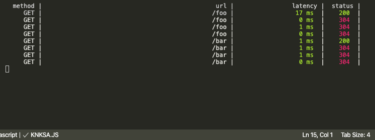

# watch-api
## Installation

This is a [Node.js](https://nodejs.org/en/) module available through the
[npm registry](https://www.npmjs.com/). Installation is done using the
[`npm install` command](https://docs.npmjs.com/getting-started/installing-npm-packages-locally):

```sh
$ npm install watch-api
```

## API

```js
const logger = require('watch-api')
```

## Example

A simple example using `watch-api` to log api response time and status.

```js
const express = require('express');
const logger = require('watch-api');

const app = express();

app.use(logger); //place at top to get accurate response time

app.get('/foo', function (req, res, next) {
  res.send('Have a good day!');
});

app.get('/bar', function (req, res, next) {
  res.send('Have a good night!')
});

app.listen(3070,()=>{});
```
## Console Output


## License

[MIT](LICENSE)